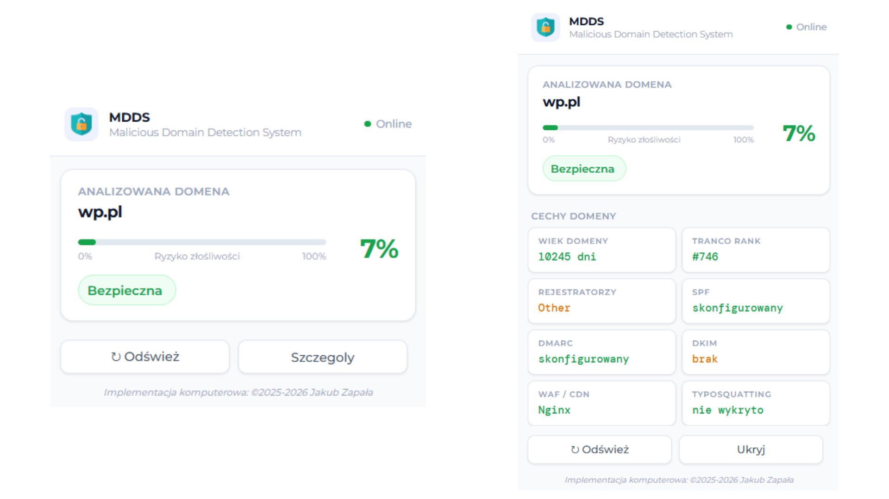

# MDDS - Malicious Domain Detection System

System wykrywania złośliwych domen w czasie rzeczywistym, opracowany jako praktyczne zastosowanie wyników pracy dyplomowej *„Analiza skuteczności wybranych modeli uczenia maszynowego w detekcji złośliwych stron internetowych”*. Złożony jest z lokalnego serwera klasyfikacyjnego (FastAPI + model XGBoost) oraz rozszerzenia do przeglądarki Chrome. Wtyczka analizuje domenę każdej odwiedzanej strony i wyświetla ocenę ryzyka na podstawie wektora 44 cech infrastrukturalnych, leksykalnych, strukturalnych i reputacyjnych.



## Struktura projektu

```
MDDS/
├── extension/                     # Rozszerzenie Chrome (Manifest V3)
│   ├── manifest.json              # Deklaracja wtyczki i uprawnień
│   ├── background.js              # Service worker - monitoring kart, odznaka ikony
│   ├── popup.html                 # Interfejs popup
│   ├── popup.js                   # Logika popup, komunikacja z API
│   └── icons/                     # Ikony wtyczki
│
└── server/                        # Serwer klasyfikacyjny (FastAPI)
    ├── main.py                    # Punkt wejścia, konfiguracja CORS, lifespan
    ├── config/
    │   └── settings.py            # Ścieżki, słowniki normalizacyjne, listy referencyjne
    ├── src/
    │   ├── api/
    │   │   └── router.py          # Endpointy /health, /classify, /cache/clear
    │   └── core/
    │       └── classifier.py      # Ładowanie modelu i predykcja
    ├── features/
    │   ├── pipeline.py            # gather_domain_features() - agregacja 44 cech
    │   ├── dns.py                 # Rekordy DNS, SPF/DKIM/DMARC
    │   ├── whois.py               # Wiek domeny, rejestrator, kraj
    │   ├── http.py                # robots.txt, security.txt, detekcja WAF/CDN
    │   ├── lexical.py             # Entropia, słowa kluczowe, typ TLD
    │   ├── levenshtein.py         # Detekcja typosquattingu
    │   ├── url.py                 # Cechy strukturalne adresu URL
    │   └── tranco.py              # Ranking popularności Tranco Top 1M
    ├── models/                    # model.pkl, feature_columns.pkl, model_meta.json
    └── cache/                     # Bufor odpowiedzi HTTP (requests-cache, SQLite)
```
## Instalacja i uruchomienie

### 1. Klonowanie repozytorium

```bash
git clone https://github.com/kubazap/MDDS
cd MDDS
```

### 2. Uruchomienie serwera API

```bash
cd server
pip install fastapi uvicorn scikit-learn pandas joblib dnspython python-whois requests requests-cache tldextract
python main.py
```

Serwer uruchomi się na `http://127.0.0.1:8000`, ładując model XGBoost oraz listę Tranco Top 1M (pobieraną automatycznie przy pierwszym starcie, aktualizowaną tygodniowo).

### 3. Instalacja rozszerzenia w Chrome

1. Otwórz `chrome://extensions`
2. Włącz **Tryb dewelopera**
3. Kliknij **Załaduj rozpakowane** i wskaż katalog `extension/`
4. Upewnij się, że serwer API działa na porcie **8000**

### 4. Weryfikacja działania

Otwórz dowolną stronę internetową i kliknij ikonę wtyczki MDDS w pasku narzędzi przeglądarki - powinien pojawić się wynik klasyfikacji analizowanej domeny wraz z panelem szczegółów cech.

## Funkcjonalności

### Rozszerzenie Chrome

- **Automatyczna klasyfikacja** - przy każdej zmianie karty lub załadowaniu strony domena jest wysyłana do lokalnego API (`127.0.0.1:8000`)
- **Odznaka ikony** - procentowa wartość `p_malicious` wyświetlana bezpośrednio na ikonie wtyczki, kolorowana wg progu ryzyka
- **Panel popup** - pasek ryzyka (gauge), werdykt (Bezpieczna / Podejrzana / Złośliwa) oraz status połączenia z serwerem
- **Panel szczegółów** - siatka cech domeny: wiek domeny, pozycja w rankingu Tranco, grupa rejestratora, SPF/DKIM/DMARC, WAF/CDN, wynik detekcji typosquattingu
- **Buforowanie dwupoziomowe** - wyniki cache'owane w service workerze i `chrome.storage.session` (TTL 5 min), z możliwością wymuszenia odświeżenia (`force=true`)

### Serwer API

| Endpoint | Opis |
|----------|------|
| `GET /health` | Stan serwera, typ modelu, liczba cech, rozmiar bufora |
| `GET /classify` | Klasyfikacja domeny – ekstrakcja 44 cech i predykcja modelu |
| `GET /cache/clear` | Czyszczenie bufora wyników oraz buforów DNS/WHOIS/HTTP |

Serwer implementuje dodatkowo bufor wyników w pamięci (LRU, limit 10 000 wpisów) oraz pomiar czasu ekstrakcji per moduł, zwracany w polu `timings_ms` odpowiedzi.

### Potok ekstrakcji cech (44 cechy z 7 źródeł, 4 kategorie)

| Kategoria | Liczba cech | Źródło | Typ zapytania |
|---|---|---|---|
| Infrastrukturalne (DNS, SPF/DKIM/DMARC, WHOIS, HTTP) | 24 | dnspython, python-whois, requests | sieciowe |
| Leksykalne (nazwa domeny, entropia, słowa kluczowe) | 11 | analiza ciągu znaków | lokalne |
| Strukturalne (odległość Levenshteina, struktura URL) | 6 | analiza adresu URL / lista 24 marek | lokalne |
| Reputacyjne (ranking Tranco Top 1M) | 3 | ranking Tranco | lokalne |

Najsilniejszymi predyktorami złośliwości (test F ANOVA) okazały się `domain_age_days` (wiek domeny) i `tranco_in_top1m` (obecność w rankingu popularności) - oba ze zbliżoną wartością statystyki F rzędu 86 000.

## Technologie

### Serwer
- **Python 3.12**
- **FastAPI 0.111** - warstwa REST API, asynchroniczne przetwarzanie żądań
- **scikit-learn 1.4** - ColumnTransformer, ocena jakości modelu
- **dnspython 2.6** - zapytania DNS, weryfikacja SPF/DKIM/DMARC
- **python-whois 0.9** - dane rejestracyjne WHOIS
- **requests** + **requests-cache 1.2** - zapytania HTTP z buforowaniem (SQLite)
- **tldextract** - parsowanie domen i TLD
- **joblib**, **pandas** - wczytywanie modelu i przygotowanie wektora cech

### Rozszerzenie
- **Chrome Extensions API**, Manifest V3
- **Vanilla JavaScript** - service worker + logika popup
- **chrome.storage.session** - przekazywanie wyników między tłem a popupem

---

Implementacja komputerowa: ©2025-2026 Jakub Zapała
